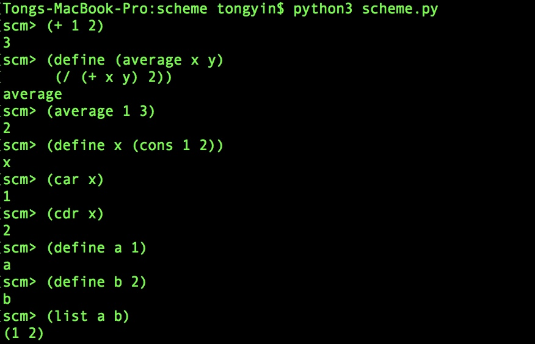
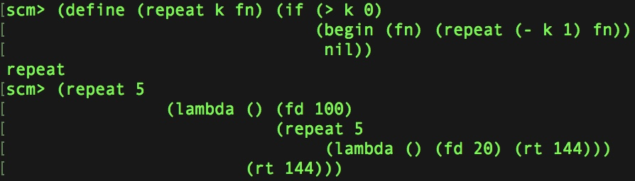
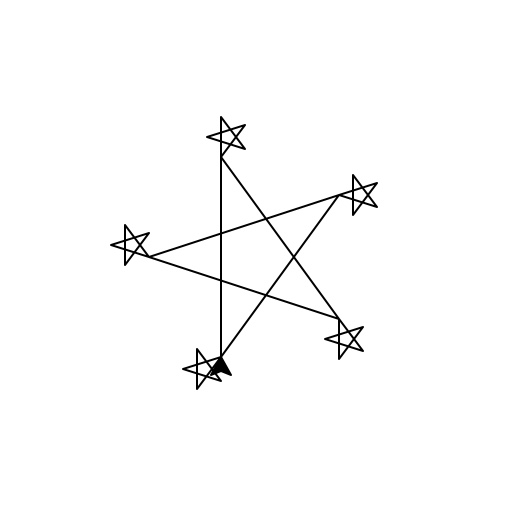
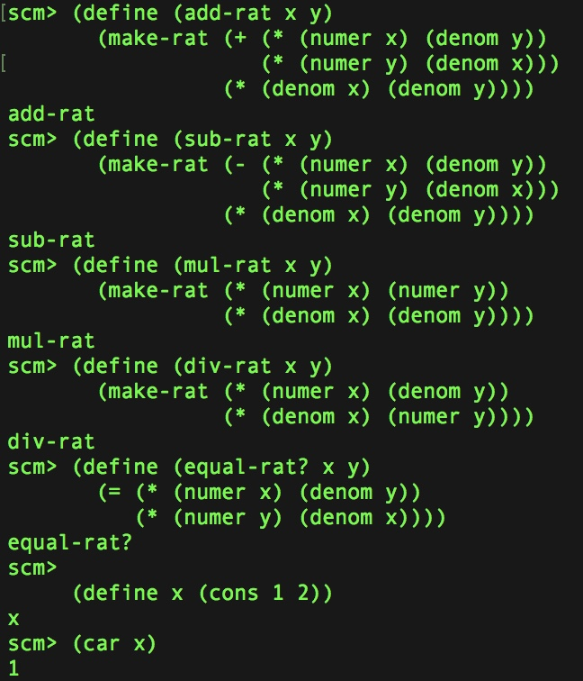

# Scheme-Interpreter

This is a Scheme Language Interpreter developed by Python. It's the last project from 2018 Berkley's CS61A Summer class.
You can learn more about the programming language Scheme in the wikipedia:  https://en.wikipedia.org/wiki/Scheme_(programming_language)

## Examples
Some of the examples of using the terminal to write mini functions/programs in Scheme are shown below. The language is interpreted and processed by python.

